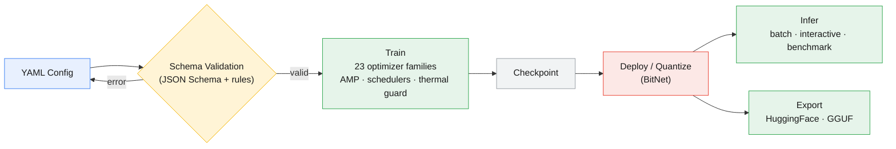
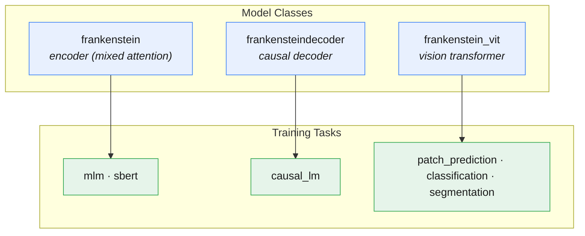

# Frankenstein Transformer

[](https://www.python.org/downloads/)
[](https://pytorch.org/)
[](LICENSE)
[](https://github.com/erickfmm/frankenstein-transformer/actions)
[](https://pypi.org/project/frankenstein-transformer/)
[](https://frankenstein-transformer.readthedocs.io/en/latest/)

**See [frankenstein-transformer](https://erickfmm.github.io/frankenstein-transformer/index.html) for a web interface to configure your YAML!**

## At a Glance

A **schema-first, config-driven transformer experimentation toolkit**: pick mixers, optimizers, norms and positional encodings from one strict JSON-Schema-validated YAML — no code changes needed.

| Mixers | Optimizers | Pos. Encodings | Model Classes | Training Tasks | Presets | CLI Commands |
|:------:|:----------:|:--------------:|:-------------:|:--------------:|:-------:|:------------:|
| **42** | **23** | **11** | **3** | **6** | **122** | **9** |

## How It Works



## Model Classes & Tasks



## Quick Start

Python **>= 3.10** required.

| Method | Command |
|--------|---------|
| **uv** (recommended) | `git clone https://github.com/erickfmm/frankenstein-transformer.git && cd frankenstein-transformer && uv venv && source .venv/bin/activate && uv pip install -e ".[train]"` |
| **pip** | `python -m venv .venv && source .venv/bin/activate && pip install -e ".[train]"` |
| **conda** | `conda create -n frankenstein python=3.10 && conda activate frankenstein && pip install -e ".[train]"` |
| **PyPI** | `pip install frankenstein-transformer` |

Verify: `frankenstein-transformer --help`

List available named presets: `frankenstein-transformer train --list-configs`

## Feature Matrix

| Feature | Scale |
|---------|-------|
| Sequence mixer architectures | 42 across 8 categories (Dense, GQA, Recurrent, Sparse, Gated, Fast-Weight, Latent, Geometric) |
| Optimizer families | 23 across 6 categories |
| Positional encodings | 11 model-wide (`rope`, `hope`, `nope`, `alibi`, `bam`, `pape*`, `sinusoidal_*`, `learned_absolute`) with per-mixer opt-out |
| Model classes | `frankenstein`, `frankensteindecoder`, `frankenstein_vit` + reusable in-process engine API |
| Training tasks | `mlm`, `sbert`, `causal_lm`, `patch_prediction`, `classification`, `segmentation` |
| Normalization types | `layer_norm`, `dynamic_tanh`, `derf`, `rms_norm`, `prms_norm`, `flash_norm` |
| Config presets | 34 named presets + 88 example configs (schema smoke-tested in CI) |
| CLI subcommands | 9 |
| Web configuration UI | Streamlit schema-driven YAML builder |
| Quantized deployment | BitNet + checkpoint export pipeline (HF Transformers / GGUF) |
| SBERT workflows | Training + inference (similarity, search, cluster, encode) |
| DashAI integration | `dashai-frankenstein` plugin (MLM classifier, causal decoder, ViT classifier, ViT segmenter) |

## Architecture Decision Table

| Model Class | Mode | Use Case |
|-------------|------|----------|
| `frankenstein` | Encoder | Full-featured MLM pre-training with mixed attention, MoE, and all 42 mixer types |
| `frankensteindecoder` | Decoder | Autoregressive causal decoder for LLM-style generation; forces `mode: decoder` |
| `frankenstein_vit` | Encoder (vision) | Vision Transformer (arXiv:2010.11929) for image understanding: patch prediction, classification, segmentation (arXiv:2503.19108); forces `mode: encoder`, requires `image:` + `dataset:` blocks |

See [configs/README.md](configs/README.md) for preset details and [docs/specs/](docs/specs/) for architecture deep-dives.

## CLI Command Reference

| Subcommand | Purpose | Example |
|------------|---------|---------|
| `train` | Run schema-validated training | `frankenstein-transformer train --config-name frankenstein --device auto` |
| `deploy` | Export checkpoint to deployment artifacts | `frankenstein-transformer deploy --checkpoint ckpt.pt --output deployed/ --format quantized` |
| `quantize` | Shortcut for quantized deployment | `frankenstein-transformer quantize --checkpoint ckpt.pt --output deployed_q/ --validate` |
| `infer` | Batch/interactive/benchmark inference | `frankenstein-transformer infer --model deployed/ --text "hello" --device auto` |
| `sbert-train` | Train sentence embedding model | `frankenstein-transformer sbert-train --output_dir ./sbert_out --batch_size 16 --epochs 4` |
| `sbert-infer` | SBERT similarity/search/cluster/encode | `frankenstein-transformer sbert-infer --model_path ./sbert_out --mode similarity --sentence1 "a" --sentence2 "b"` |
| `transformers-export` | Export to HuggingFace Transformers format | `frankenstein-transformer transformers-export --config-name frankenstein --output ./hf_export/` |
| `bitnet-gguf` | Export a BitNet model to GGUF (i2_s) for bitnet.cpp | `frankenstein-transformer bitnet-gguf --model ckpt.pt --yaml cfg.yaml --output out.gguf` |
| `web-server` | Launch Streamlit config builder UI | `frankenstein-transformer web-server` |

All model-executing commands accept `--device auto|cpu|cuda|mps`.

## Mixer Categories

| Category | Code Names | Description |
|----------|------------|-------------|
| **Dense** (2) | `standard_attn`, `sigmoid_attn` | Full quadratic attention variants |
| **GQA** (1) | `gqa_attn` | Grouped-query attention with configurable KV heads |
| **Recurrent** (6) | `retnet`, `retnet_attn`, `mamba`, `ode`, `titan_attn`, `engram_attn` | Retention networks, state-space models, continuous-depth ODE layers, memory-augmented attention, and n-gram memory |
| **Sparse** (9) | `sparse_transformer_attn`, `longformer_attn`, `bigbird_attn`, `sparsek_attn`, `nsa_attn`, `sparge_attn` ⚠️, `fasa_attn` ⚠️, `msa_attn`, `sparda_attn` | Factorized, sliding-window, token-selection, and block-sparse (GQA-based) patterns |
| **Gated** (8) | `gla_attn`, `deltanet_attn`, `gated_deltanet_attn`, `gated_deltanet2_attn`, `hgrn2_attn`, `fox_attn`, `gated_softmax_attn`, `kda_attn` | Linear attention with multiplicative gates, delta rules, and gated softmax |
| **Fast-Weight** (6) | `falcon1_attn`, `falcon2_attn`, `falcon3_attn`, `falcon1a_attn`, `falcon2a_attn`, `falcon3a_attn` | Fast-weight / online-learning attention with per-layer fast-weight update rules |
| **Latent** (10) | `mla_attn`, `gqla_attn`, `mlra_attn`, `tucker_attn`, `iha_attn`, `gta_attn`, `mtla_attn`, `cca_attn`, `ccgqa_attn`, `gma_attn` | KV-compression and head-mixing variants generalising GQA (latent attention, Tucker factorisation, interleaved pseudo-heads, temporal merging, compressed convolutional attention, Gaussian mixture attention) |
| **Geometric** (1) | `ssog_attn` | Separable Sum of Gaussians — geometric field attention |

⚠️ `sparge_attn` and `fasa_attn` are **eval-only** — training raises a runtime error.

Configure via `layer_pattern` in YAML. See [src/schema.yaml](src/schema.yaml) for the full mixer reference table and [docs/specs/attention-mixers.md](docs/specs/attention-mixers.md) for the taxonomy deep-dive.

## Optimizer Categories

| Category | Optimizers | Count |
|----------|------------|-------|
| **Classical** | `sgd_momentum`, `adamw`, `radam`, `adan`, `adopt`, `ademamix`, `lamb` | 7 |
| **Variance Reduction** | `mars_adamw`, `cautious_adamw` | 2 |
| **Memory-Efficient** | `adafactor`, `galore_adamw`, `lion`, `apollo`, `apollo_mini`, `q_apollo` | 6 |
| **Schedule-Free** | `schedulefree_adamw`, `prodigy` | 2 |
| **Second-Order** | `sophia`, `shampoo`, `soap` | 3 |
| **Geometry-Oriented** | `muon`, `turbo_muon`, `anon` | 3 |

Parameters use prefixed keys: `<optimizer_class>-<group>_<param>` (e.g. `adamw-lr_embeddings`, `muon-ns_steps`). See [configs/README.md](configs/README.md) for the full parameter reference.

## Engine API & DashAI Plugin

Beyond the CLI, a thin **in-process engine API** ([src/engine.py](src/engine.py)) exposes model construction, tokenizer setup, dataset wiring, and the training loop as plain Python functions — no argparse, no subprocesses:

```python
from src.engine import build_model, train_from_config, save_checkpoint, load_checkpoint
```

This engine powers the **`dashai-frankenstein` plugin**, which registers Frankenstein's model classes as [DashAI](https://github.com/DashAIOpen/DashAI) components (5 `dashai.plugins` entry points): `FrankensteinMLMModel` (text classification via MLM encoder), `FrankensteinDecoderModel` (generative), `FrankensteinViTClassifier`, and `FrankensteinViTSegmenter` (+ `SegmentationTask`). The package is published on [PyPI](https://pypi.org/project/frankenstein-transformer/); see [docs/dashai-plugin-audit.md](docs/dashai-plugin-audit.md) for the integration design.

## Documentation Map

| Resource | Content |
|----------|---------|
| [configs/README.md](configs/README.md) | Schema walkthrough, preset details, optimizer parameter reference |
| [src/schema.yaml](src/schema.yaml) | Authoritative training config schema (source of truth) |
| [docs/README.md](docs/README.md) | CLI reference and workflow guide |
| [docs/paper/paper.pdf](docs/paper/paper.pdf) | Technical report (English) |
| [docs/paper-es/paper-es.pdf](docs/paper-es/paper-es.pdf) | Technical report (Spanish) |
| [docs/specs/](docs/specs/) | Architecture and feature specifications |
| [docs/specs/vision.md](docs/specs/vision.md) | Vision Transformer (frankenstein_vit) spec — patch prediction, classification, segmentation |
| [docs/specs/attention-mixers.md](docs/specs/attention-mixers.md) | Mixer taxonomy (42 variants / 8 categories) and selection guide |
| [docs/dashai-plugin-audit.md](docs/dashai-plugin-audit.md) | DashAI plugin integration design and status |
| [frankenstein-transformer.readthedocs.io](https://frankenstein-transformer.readthedocs.io/en/latest/) | Full hosted documentation (specs, API, papers, bibliography) |
| [docs/transformers_compatibility.md](docs/transformers_compatibility.md) | HuggingFace export compatibility guide |

## Quick Training Example

Minimal YAML config (`my_config.yaml`) — only the 5 required model fields plus task; everything else uses FrankensteinModelConfig/TrainingConfig defaults:

```yaml
model_class: frankenstein
model:
  vocab_size: 30522
  hidden_size: 256
  num_layers: 4
  num_heads: 8
  layer_pattern: [standard_attn, standard_attn, standard_attn, standard_attn]
training:
  task: mlm
  batch_size: 8
  max_length: 128
  mlm_probability: 0.15
  max_samples: 100000
  dataset_batch_size: 10000
  num_workers: 4
  cache_dir: "./temp_data/cache"
  optimizer:
    optimizer_class: adamw
    parameters:
      adamw-lr_embeddings: 1e-4
      adamw-lr_norms: 1e-4
      adamw-lr_attention: 1e-4
      adamw-lr_other: 1e-4
      adamw-wd_embeddings: 0.01
      adamw-wd_norms: 0.01
      adamw-wd_attention: 0.01
      adamw-wd_other: 0.01
      adamw-betas_embeddings: [0.9, 0.95]
      adamw-betas_norms: [0.9, 0.95]
      adamw-betas_attention: [0.9, 0.95]
      adamw-betas_other: [0.9, 0.95]
      adamw-eps_embeddings: 1e-8
      adamw-eps_norms: 1e-8
      adamw-eps_attention: 1e-8
      adamw-eps_other: 1e-8
  scheduler_total_steps: 1000
```

Unspecified model fields fall back to FrankensteinModelConfig defaults (`num_loops=2`, `dropout=0.1`, `norm_type=dynamic_tanh`, `use_moe=true`, `ffn_activation=silu`, etc.). Unspecified training fields fall back to TrainingConfig defaults (`scheduler_type=cosine`, `grad_clip_max_norm=5.0`, `gpu_temp_guard_enabled=true`, etc.). Override only what you need to change.

Run:

```bash
frankenstein-transformer train --config my_config.yaml --device auto
```

## Vision Transformer (frankenstein_vit) Example

The `frankenstein_vit` model class (arXiv:2010.11929) splits images into patches, embeds them, and processes the sequence through the same HybridLayer stack as the text models. It supports three tasks: `patch_prediction` (autosupervised masked patch prediction), `classification` (image classification), and `segmentation` (per-pixel or EoMT query-based, arXiv:2503.19108).

Minimal classification YAML (`vit_config.yaml`):

```yaml
model_class: frankenstein_vit
model:
  dims:
    hidden_size: 768
    num_layers: 12
    num_heads: 12
    layer_pattern: [standard_attn]
    mode: encoder
  norm: {type: layer_norm}
  use_moe: false
  use_bitnet: false
  ffn_activation: gelu
  ffn_hidden_size: 3072
image:
  image_size: {height: 224, width: 224}
  patch_size: 16
  in_channels: 3
  pos_embedding_type: learned_1d
  cls_token: true
  pooling_mode: cls
  num_classes: 10
dataset:
  dataset_name: cifar10
  rescale: {height: 224, width: 224}
training:
  task: classification
  batch_size: 512
  num_epochs: 90
  optimizer:
    optimizer_class: adamw
    parameters:
      adamw-lr_other: 0.001
      adamw-wd_other: 0.1
  classification:
    batch_size: 512
    num_epochs: 90
    learning_rate: 0.001
```

Run: `frankenstein-transformer train --config vit_config.yaml --device auto`

See [configs/frankenstein_vit_base.yaml](configs/frankenstein_vit_base.yaml) for the full ViT-Base/16 preset and [docs/specs/vision.md](docs/specs/vision.md) for the complete specification.

## License

MIT License — Copyright (c) 2026 Erick Merino. See [LICENSE](LICENSE) for full text.